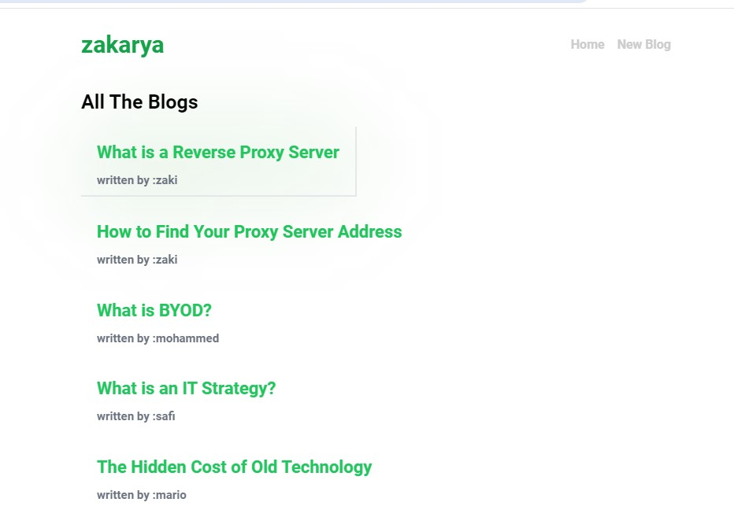
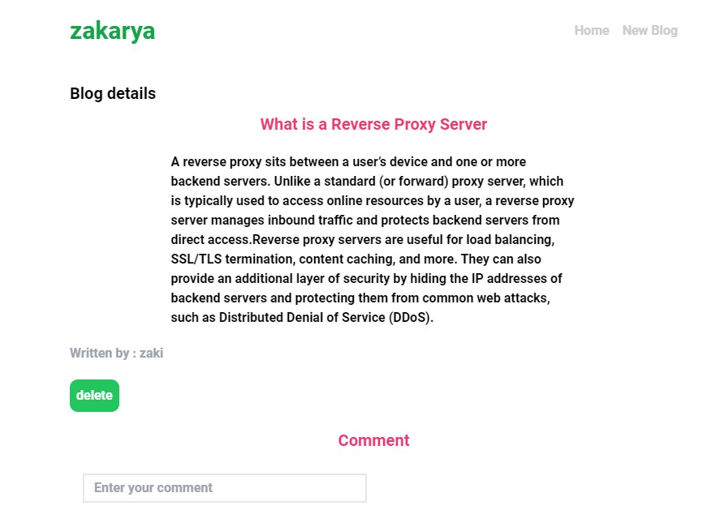
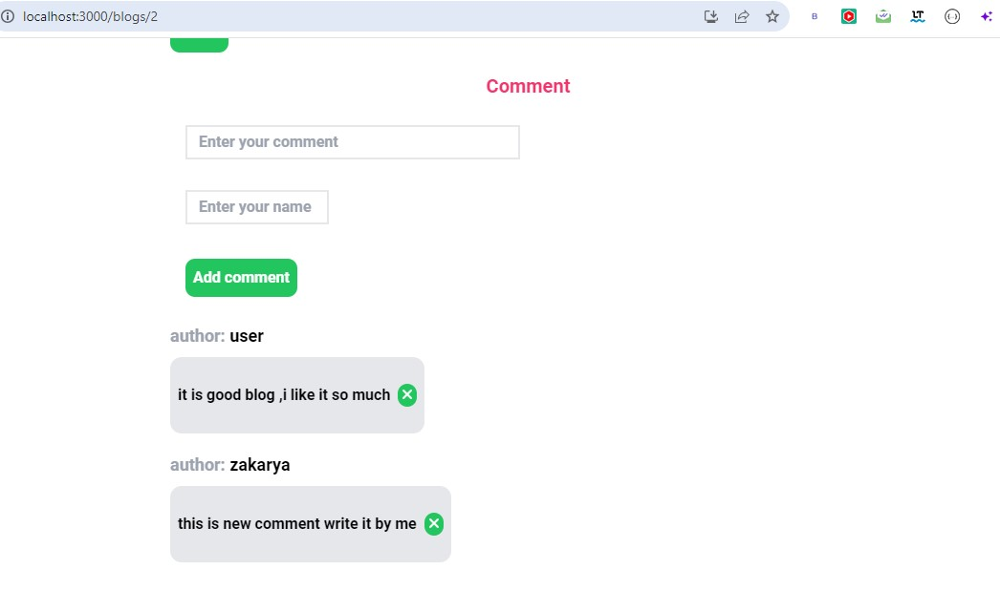
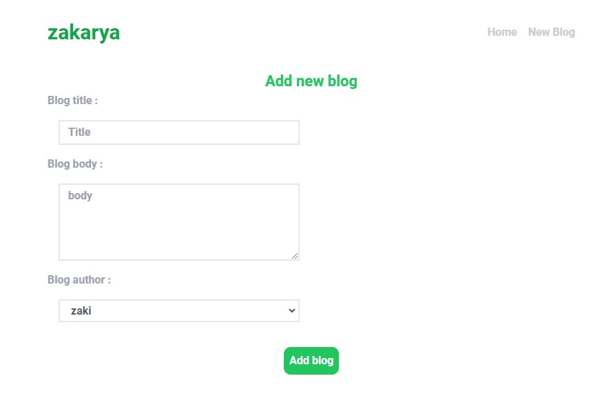

This app has build during my learning journey with react following the net ninja youtube tutorial

# blog-app-react
This professional project is a recently developed React application that allows users to manipulate blogs by adding and deleting them. The project utilizes a local JSON server for storing the blog data, ensuring efficient data management.In this project we use also the router in react to facilate moving between pages .Recently , i add to this project the abitlity to add comments for each blog you want .

Picture show up the project :

